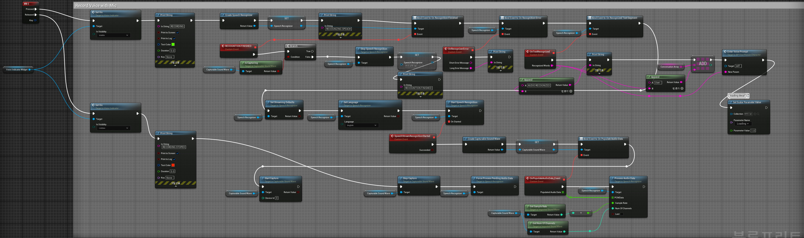
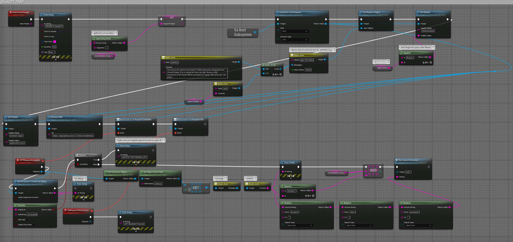
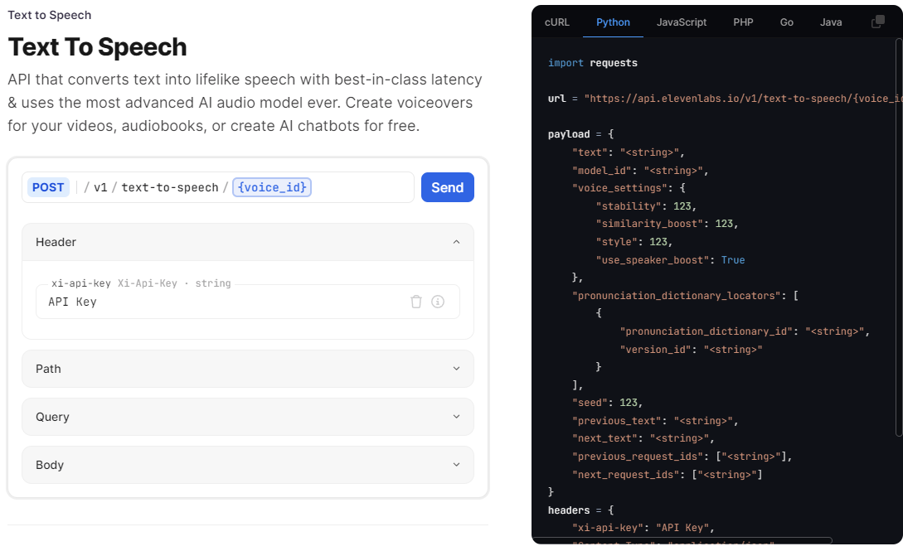
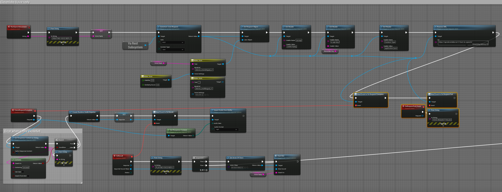
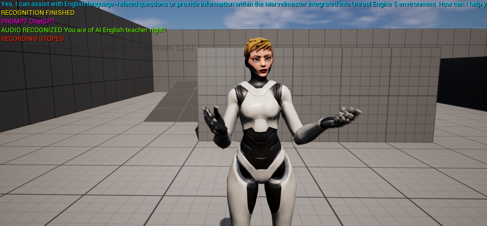
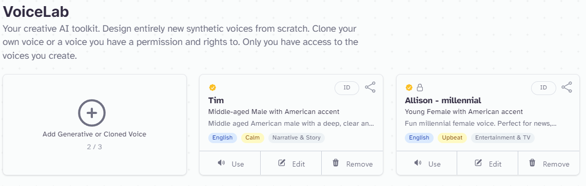

# 메타휴먼 AI 영어강사 구현 (Implementation of a MetaHuman AI English Teacher)

## 목적
LLM(대규모 언어 모델) 기술과 언리얼 엔진(Unreal Engine)을 활용하여 가상인간을 구현하고, 이 가상인간에게 영어 강사의 역할을 부여하여 메타휴먼 강사로 구현한다.

## 사용 프로그램 및 라이브러리

- **사용 프로그램**: Unreal Engine 5.3
- **사용 라이브러리**:
    - VaRest - HTTP 및 JSON 기능을 제공하여 웹 서비스와의 통신을 쉽게 할 수 있는 언리얼 엔진용 플러그인
    - Runtime Audio Importer - 런타임에 오디오 파일을 가져와 동적 오디오 처리를 가능하게 하는 라이브러리
    - Runtime Speech Recognizer - 실시간 음성 인식을 가능하게 하여 음성을 텍스트로 변환하는 라이브러리
- **사용 API**:
    - OpenAI ChatGPT API (현재 Llama3기반 개인 LLM 장착가능) - 텍스트 기반의 AI 대화를 생성
    - ElevenLabs Text-to-Speech API - 다양한 voice 모델을 불러와서 ChatGPT의 텍스트 응답을 자연스러운 음성으로 변환

## 주요 구현 방식

해당 프로젝트는 총 3가지의 큰 틀에서 이루어진다.
1. 마이크 인식 및 음성 받아쓰기 (Speech to Text, STT)
2. 입력된 텍스트 처리 및 ChatGPT 호출
3. AI 가상인간(영어 강사) 애니메이션 및 응답

### 1. 마이크 인식 및 음성 받아쓰기 (Speech to Text, STT)

다음은 블루프린트를 사용하여 마이크 인식 및 음성 받아쓰기(Speech to Text, STT) 과정을 구현하는 방법이다. 블루프린트의 각 블럭에 대한 자세한 설명을 포함한다.  
E키를 Hold하고 있을때를 음성을 받아들이는 방식으로 진행된다.

### 작동 순서

1. **Voice Indicator Widget**: 음성 입력이 시작되면 Voice Indicator Widget의 가시성을 'Visible'로 설정한다.
2. **Create Speech Recognizer**: 음성 인식을 위한 Speech Recognizer 인스턴스를 생성하고 변수에 저장한다.
3. **Print String - Recognizing Speech**: 음성 인식이 시작됨을 알리는 디버그 메시지를 출력한다.
4. **Set Language**: Speech Recognizer의 언어를 영어로 설정한다.
5. **Start Capture**: 음성 데이터를 캡처할 수 있는 Sound Wave를 생성하고 변수에 저장한 후, 음성 데이터 캡처를 시작한다. 음성 인식이 시작됨을 알린다.
6. **Stop Capture**: 음성 데이터 캡처를 중지하고, 남아있는 음성 데이터를 모두 처리하도록 강제한다.
7. **Recognition Finished Event**: 음성 인식이 완료되었음을 알리는 이벤트를 발생시킨다. 현재 음성 캡처가 진행 중인지 확인하는 조건문을 통해 True/False에 따라 분기하고, 음성 인식이 완료되었음을 알리는 디버그 메시지를 출력한다.
8. **Speech Recognition Events**: 음성 인식 완료 및 오류 이벤트를 처리하기 위해 이벤트를 바인딩한다. 인식된 텍스트를 처리

#### 블럭 설명 

1. **Voice Indicator Widget**
   - **설명**: 사용자가 마이크를 통해 음성을 입력할 때 이를 시각적으로 표시하기 위한 위젯.
   - **블럭 설명**:
     - `Set Visibility`: 마이크가 인식되는 동안 Voice Indicator Widget의 가시성을 'Visible'로 설정한다. 
       - **Input**: `Target` (Voice Indicator Widget), `In Visibility` (Visible)
       - **Output**: Visibility가 설정된 Voice Indicator Widget

2. **Create Speech Recognizer**
   - **설명**: 음성 인식을 위한 Speech Recognizer를 생성한다.
   - **블럭 설명**:
     - `Create Speech Recognizer`: 음성 인식을 위해 Speech Recognizer 인스턴스를 생성한다.
       - **Input**: 없음
       - **Output**: `Speech Recognizer` 인스턴스
     - `Set`: 생성된 Speech Recognizer를 변수에 저장한다.
       - **Input**: `Speech Recognizer` 인스턴스
       - **Output**: 변수에 저장된 Speech Recognizer

3. **Print String - Recognizing Speech**
   - **설명**: 음성 인식 시작을 알리는 디버그 메시지를 출력한다.
   - **블럭 설명**:
     - `Print String`: 디버그 콘솔에 "RECOGNIZING SPEECH" 문자열을 출력한다.
       - **Input**: `In String` ("RECOGNIZING SPEECH")
       - **Output**: 디버그 메시지 출력

4. **Set Language**
   - **설명**: 음성 인식기의 언어를 설정한다.
   - **블럭 설명**:
     - `Set Language`: Speech Recognizer의 언어를 영어(`English`)로 설정한다.
       - **Input**: `Target` (Speech Recognizer), `Language` (English)
       - **Output**: 언어가 설정된 Speech Recognizer

5. **Start Capture**
   - **설명**: 음성 데이터를 캡처하기 시작한다.
   - **블럭 설명**:
     - `Create Captureable Sound Wave`: 음성 데이터를 캡처할 수 있는 Sound Wave를 생성한다.
       - **Input**: 없음
       - **Output**: `Captureable Sound Wave` 인스턴스
     - `Set`: 생성된 Captureable Sound Wave를 변수에 저장한다.
       - **Input**: `Captureable Sound Wave` 인스턴스
       - **Output**: 변수에 저장된 Captureable Sound Wave
     - `Start Capture`: 음성 데이터를 캡처하기 위해 Captureable Sound Wave를 시작한다.
       - **Input**: `Target` (Captureable Sound Wave)
       - **Output**: 캡처가 시작된 Sound Wave
     - `Stream Recognition Started`: 음성 인식이 시작되었음을 알린다.
       - **Input**: 없음
       - **Output**: 음성 인식 시작 상태

6. **Stop Capture**
   - **설명**: 음성 데이터 캡처를 중지한다.
   - **블럭 설명**:
     - `Stop Capture`: 음성 데이터를 캡처하는 과정을 중지한다.
       - **Input**: `Target` (Captureable Sound Wave)
       - **Output**: 캡처 중지
     - `Force Process Pending Audio Data`: 남아있는 음성 데이터를 모두 처리하도록 강제한다.
       - **Input**: `Target` (Speech Recognizer)
       - **Output**: 모든 남아있는 데이터 처리

7. **Recognition Finished Event**
   - **설명**: 음성 인식이 완료되었음을 알리는 이벤트이다.
   - **블럭 설명**:
     - `Recognition Finished`: 음성 인식이 완료되었음을 알리는 이벤트를 발생시킨다.
       - **Input**: 없음
       - **Output**: Recognition Finished 이벤트
     - `Is Capturing`: 현재 음성 캡처가 진행 중인지 확인하는 조건문이다.
       - **Input**: `Target` (Captureable Sound Wave)
       - **Output**: 음성 캡처 진행 상태 (True/False)
     - `Branch`: 조건문에 따라 처리 흐름을 분기한다.
       - **Input**: `Condition` (Is Capturing의 출력)
       - **Output**: True/False에 따른 분기
     - `Print String`: 음성 인식이 완료되었음을 디버그 문자열로 출력한다.
       - **Input**: `In String` ("RECOGNITION FINISHED")
       - **Output**: 디버그 메시지 출력

8. **Speech Recognition Events**
   - **설명**: 음성 인식 과정에서 발생하는 다양한 이벤트를 처리한다.
   - **블럭 설명**:
     - `Bind Events to Recognition Finished`: 음성 인식 완료 이벤트를 처리하기 위해 이벤트 바인딩을 설정한다.
       - **Input**: `Target` (Speech Recognizer), `Event` (Recognition Finished)
       - **Output**: 이벤트 바인딩
     - `Bind Events to Recognition Error`: 음성 인식 오류 이벤트를 처리하기 위해 이벤트 바인딩을 설정한다.
       - **Input**: `Target` (Speech Recognizer), `Event` (Recognition Error)
       - **Output**: 이벤트 바인딩
     - `On Recognize Error`: 음성 인식 중 오류가 발생했을 때 처리하는 이벤트이다.
       - **Input**: 오류 발생 시 호출
       - **Output**: 오류 처리
     - `On Recognized Text Segment`: 인식된 텍스트를 처리하는 이벤트이다.
       - **Input**: 텍스트 인식 시 호출
       - **Output**: 텍스트 처리

9. **Print String - Error Handling**
   - **설명**: 음성 인식 오류 발생 시 디버그 메시지를 출력한다.
   - **블럭 설명**:
     - `Print String`: 디버그 콘솔에 오류 메시지를 출력한다.
       - **Input**: `In String` (오류 메시지)
       - **Output**: 디버그 메시지 출력

10. **Output Recognized Text**
    - **설명**: 인식된 텍스트를 출력하거나 후속 처리로 전달한다.
    - **블럭 설명**:
      - `Append`: 인식된 텍스트를 문자열 배열에 추가한다.
        - **Input**: `String A` (기존 텍스트), `String B` (인식된 텍스트)
        - **Output**: 결합된 텍스트
      - `Add`: Conversation Array에 새로운 문자열을 추가한다.
        - **Input**: `Target` (Conversation Array), `Item` (새로운 텍스트)
        - **Output**: 업데이트된 Conversation Array
      - `Extra Voice Prompt`: 추가 음성 프롬프트를 처리하는 블럭이다.
        - **Input**: `Target` (AI Character), `Text` (추가 프롬프트)
        - **Output**: 추가 프롬프트 처리

11. **Set Scalar Parameter Value**
    - **설명**: 특정 파라미터 값을 설정한다.
    - **블럭 설명**:
      - `Set Scalar Parameter Value`: 'Loading' 파라미터 값을 설정하여 시각적 피드백을 제공한다.
        - **Input**: `Collection` (파라미터 컬렉션), `Parameter Name` (Loading), `Parameter Value` (1.0)
        - **Output**: 설정된 파라미터 값

### 2. 입력된 텍스트 처리 및 ChatGPT 호출

### 작동 순서

1. `EnterVoicePrompt` 이벤트가 트리거되어 새로운 음성 프롬프트를 처리한다.
2. `Print String` 블럭이 "PROMPT ChatGPT" 메시지를 디버그 콘솔에 출력한다.
3. 이전 대화 내용을 결합하여 `Input Prompt` 변수에 저장한다.
4. ChatGPT API 호출을 위한 JSON 요청 객체를 생성하고 설정한다.
5. HTTP 요청 헤더를 설정하고 API 호출을 위한 URL을 처리한다.
6. 요청 완료 및 실패 이벤트를 바인딩하여 API 호출 결과를 처리한다.
7. 요청이 완료되면 `On Request Complete` 이벤트가 호출되고, 응답 JSON을 파싱하여 필요한 데이터를 추출한다.
8. 추출된 응답 내용을 디버그 콘솔에 출력하고 대화 배열에 추가한다.
9. `Run Speech Assistant` 블럭을 통해 가상인간에게 응답 내용을 전달하여 음성으로 출력한다.

#### 블럭 설명 

1. **EnterVoicePrompt (Custom Event)**
   - **설명**: 새로운 음성 프롬프트가 입력되었음을 알리는 커스텀 이벤트.
   - **블럭 설명**:
     - `EnterVoicePrompt`: 입력된 음성 프롬프트를 처리하는 커스텀 이벤트를 생성한다.

2. **Print String - Prompt Received**
   - **설명**: 입력된 음성 프롬프트를 디버그 메시지로 출력.
   - **블럭 설명**:
     - `Print String`: 디버그 콘솔에 "PROMPT ChatGPT" 문자열을 출력한다.
       - **Input**: `In String` ("PROMPT ChatGPT")
       - **Output**: 디버그 메시지 출력

3. **Gathered Conversation**
   - **설명**: 이전 대화 내용을 모아서 문자열 배열로 결합.
   - **블럭 설명**:
     - `Join String Array`: Conversation Array의 모든 문자열을 하나로 결합한다.
       - **Input**: `Source Array` (Conversation Array)
       - **Output**: 결합된 문자열

4. **Set Input Prompt**
   - **설명**: 입력된 음성 프롬프트를 변수에 저장.
   - **블럭 설명**:
     - `Set`: Input Prompt 변수를 설정한다.
       - **Input**: `Input Prompt` (결합된 문자열)
       - **Output**: 저장된 Input Prompt

5. **Make JSON for ChatGPT Request**
   - **설명**: ChatGPT API 호출을 위한 JSON 객체를 생성.
   - **블럭 설명**:
     - `Make Array`: 이전 대화와 새로운 입력 프롬프트를 포함하는 배열을 생성.
       - **Input**: 이전 대화와 새로운 입력 프롬프트
       - **Output**: Messages 배열
     - `Make JSON`: JSON 객체를 생성한다.
       - **Input**: `Model` ("gpt-3.5-turbo"), `Messages` (Messages 배열), `Max Tokens` (1000)
       - **Output**: JSON 객체

6. **Construct JSON Request**
   - **설명**: JSON 요청 객체를 생성하고, API 호출을 위한 준비를 한다.
   - **블럭 설명**:
     - `Construct JSON Request`: JSON 요청 객체를 생성한다.
       - **Input**: `Verb` (POST), `Content Type` (application/json)
       - **Output**: JSON 요청 객체
     - `Set Request Object`: 생성된 JSON 요청 객체를 설정한다.
       - **Input**: `JSON Object`
       - **Output**: 설정된 JSON 요청 객체

7. **Set Header**
   - **설명**: HTTP 요청 헤더를 설정한다.
   - **블럭 설명**:
     - `Set Header`: 요청 헤더를 설정한다.
       - **Input**: `Header Name` (Content-Type), `Header Value` (application/json)
       - **Output**: 설정된 요청 헤더
     - `Set Header`: 요청 헤더에 인증 정보를 추가한다.
       - **Input**: `Header Name` (Authorization), `Header Value` ("Bearer YOUR_API_KEY")
       - **Output**: 설정된 인증 헤더

8. **Process URL**
   - **설명**: ChatGPT API를 호출하는 URL을 처리한다.
   - **블럭 설명**:
     - `Process URL`: API 호출을 위한 URL을 설정하고 호출을 실행한다.
       - **Input**: `URL` (https://api.openai.com/v1/chat/completions)
       - **Output**: API 호출

9. **Bind Events**
   - **설명**: 요청 완료 및 실패 이벤트를 바인딩한다.
   - **블럭 설명**:
     - `Bind Events to On Request Complete`: 요청 완료 이벤트를 바인딩한다.
       - **Input**: `Target` (Request), `Event` (On Request Complete)
       - **Output**: 바인딩된 이벤트
     - `Bind Events to On Request Fail`: 요청 실패 이벤트를 바인딩한다.
       - **Input**: `Target` (Request), `Event` (On Request Fail)
       - **Output**: 바인딩된 이벤트

10. **On Request Complete (Custom Event)**
    - **설명**: 요청이 완료되었을 때 호출되는 커스텀 이벤트.
    - **블럭 설명**:
      - `On Request Complete`: API 요청이 성공적으로 완료되었을 때 호출된다.
        - **Input**: 없음
        - **Output**: 성공 이벤트

11. **On Request Fail (Custom Event)**
    - **설명**: 요청이 실패했을 때 호출되는 커스텀 이벤트.
    - **블럭 설명**:
      - `On Request Fail`: API 요청이 실패했을 때 호출된다.
        - **Input**: 없음
        - **Output**: 실패 이벤트
      - `Print String`: 실패 메시지를 디버그 콘솔에 출력한다.
        - **Input**: `In String` ("GPT REQUEST FAILED")
        - **Output**: 디버그 메시지 출력

12. **Get Response Content as String**
    - **설명**: API 응답 내용을 문자열로 변환.
    - **블럭 설명**:
      - `Get Response Content as String`: API 응답 내용을 문자열로 변환한다.
        - **Input**: `Response Content`
        - **Output**: 변환된 문자열

13. **Parse JSON Response**
    - **설명**: API 응답 JSON을 파싱하여 필요한 데이터를 추출.
    - **블럭 설명**:
      - `Get Object Array Field`: 응답 JSON에서 'choices' 배열을 추출한다.
        - **Input**: `Target` (Response JSON), `Field Name` (choices)
        - **Output**: 추출된 'choices' 배열
      - `Get Object Field`: 'choices' 배열에서 첫 번째 항목의 'message' 필드를 추출한다.
        - **Input**: `Target` (choices 배열 첫 번째 항목), `Field Name` (message)
        - **Output**: 추출된 'message' 필드
      - `Break JSON`: 'message' 필드에서 'content' 문자열을 추출한다.
        - **Input**: `Target` (message 필드), `Field Name` (content)
        - **Output**: 추출된 'content' 문자열

14. **Output Response**
    - **설명**: ChatGPT 응답을 출력하거나 후속 처리로 전달.
    - **블럭 설명**:
      - `Print String`: 응답 내용을 디버그 콘솔에 출력한다.
        - **Input**: `In String` (ChatGPT 응답 내용)
        - **Output**: 디버그 메시지 출력
      - `Append`: 응답 내용을 대화 배열에 추가한다.
        - **Input**: `Target` (Conversation Array), `Item` (ChatGPT 응답 내용)
        - **Output**: 업데이트된 Conversation Array
      - `Run Speech Assistant`: 응답 내용을 가상인간에게 전달하여 음성으로 출력한다.
        - **Input**: `Target` (AI Character), `String` (ChatGPT 응답 내용)
        - **Output**: 음성 출력

### 3. AI 가상인간(영어 강사) 애니메이션 및 응답
해당 파트에서는 ElevenLabs Text-to-Speech API가 필요하다. 또한 다음 페이지를 참조하여 사용이 가능하다. (https://elevenlabs.io/docs/api-reference/text-to-speech)  

### 작동 순서

1. `RunSpeechAssistent` 이벤트가 트리거되어 새로운 음성 응답 생성을 시작한다.
2. `Print String` 블럭이 "CREATING VOICE REPLY" 메시지를 디버그 콘솔에 출력한다.
3. `Set` 블럭을 통해 입력된 문자열을 Voice Reply 변수에 저장한다.
4. ChatGPT API 호출을 위한 JSON 요청 객체를 생성하고 설정한다.
5. HTTP 요청 헤더를 설정하고 API 호출을 위한 URL을 처리한다.
6. 요청 완료 및 실패 이벤트를 바인딩하여 API 호출 결과를 처리한다.
7. 요청이 완료되면 `On Request Complete` 이벤트가 호출되고, 응답 JSON을 파싱하여 필요한 데이터를 추출한다.
8. 추출된 응답 내용을 디버그 콘솔에 출력하고 대화 배열에 추가한다.
9. `Create Runtime Audio Importer` 블럭을 통해 오디오 임포터를 생성하고 변수에 저장한다.
10. `Import Audio from Buffer` 블럭을 통해 API 응답으로부터 오디오 데이터를 임포트한다.
11. `Print String` 블럭을 통해 "PLAYING VOICE REPLY" 메시지를 디버그 콘솔에 출력한다.
12. `Run Speech Assistant` 블럭을 통해 가상인간에게 응답 내용을 전달하여 음성으로 출력한다.

#### 블럭 설명 및 작동 순서

1. **RunSpeechAssistent (Custom Event)**
   - **설명**: 가상인간의 음성 응답을 트리거하는 커스텀 이벤트.
   - **블럭 설명**:
     - `RunSpeechAssistent`: 입력된 문자열을 처리하기 위한 커스텀 이벤트를 생성한다.
       - **Input**: `String`
       - **Output**: 없음

2. **Print String - Creating Voice Reply**
   - **설명**: 음성 응답 생성 시작을 알리는 디버그 메시지를 출력한다.
   - **블럭 설명**:
     - `Print String`: 디버그 콘솔에 "CREATING VOICE REPLY" 문자열을 출력한다.
       - **Input**: `In String` ("CREATING VOICE REPLY")
       - **Output**: 디버그 메시지 출력

3. **Set Voice Reply**
   - **설명**: 입력된 문자열을 Voice Reply 변수에 저장한다.
   - **블럭 설명**:
     - `Set`: Voice Reply 변수를 설정한다.
       - **Input**: `Voice Reply` (입력된 문자열)
       - **Output**: 저장된 Voice Reply

4. **Construct JSON Request**
   - **설명**: ElevenLabs API 호출을 위한 JSON 요청 객체를 생성한다.
   - **블럭 설명**:
     - `Construct JSON Request`: JSON 요청 객체를 생성한다.
       - **Input**: `Verb` (POST), `Content Type` (application/json)
       - **Output**: JSON 요청 객체
     - `Set Request Object`: 생성된 JSON 요청 객체를 설정한다.
       - **Input**: `JSON Object`
       - **Output**: 설정된 JSON 요청 객체

5. **Set Header**
   - **설명**: HTTP 요청 헤더를 설정한다.
   - **블럭 설명**:
     - `Set Header`: 요청 헤더를 설정한다.
       - **Input**: `Header Name` (accept), `Header Value` (audio/mpeg)
       - **Output**: 설정된 요청 헤더
     - `Set Header`: 요청 헤더에 인증 정보를 추가한다.
       - **Input**: `Header Name` (xi-api-key), `Header Value` (ElevenLabs API Key)
       - **Output**: 설정된 인증 헤더
     - `Set Header`: 요청 헤더에 Content-Type을 설정한다.
       - **Input**: `Header Name` (Content-Type), `Header Value` (application/json)
       - **Output**: 설정된 Content-Type 헤더

6. **Make JSON for ElevenLabs Request**
   - **설명**: ElevenLabs API 호출을 위한 JSON 객체를 생성한다.
   - **블럭 설명**:
     - `Make JSON`: 음성 응답 생성을 위한 JSON 객체를 생성한다.
       - **Input**: `Text` (Voice Reply), `Voice ID` (eleven_monolingual_v1)
       - **Output**: JSON 객체
     - `Make JSON`: 음성 설정을 위한 JSON 객체를 생성한다.
       - **Input**: `Stability` (0.5), `Similarity Boost` (0.75)
       - **Output**: JSON 객체

7. **Process URL**
   - **설명**: ElevenLabs API를 호출하는 URL을 처리한다.
   - **블럭 설명**:
     - `Process URL`: API 호출을 위한 URL을 설정하고 호출을 실행한다.
       - **Input**: `URL` (https://api.elevenlabs.io/v1/text-to-speech)
       - **Output**: API 호출

8. **Bind Events**
   - **설명**: 요청 완료 및 실패 이벤트를 바인딩한다.
   - **블럭 설명**:
     - `Bind Events to On Request Complete`: 요청 완료 이벤트를 바인딩한다.
       - **Input**: `Target` (Request), `Event` (On Request Complete)
       - **Output**: 바인딩된 이벤트
     - `Bind Events to On Request Fail`: 요청 실패 이벤트를 바인딩한다.
       - **Input**: `Target` (Request), `Event` (On Request Fail)
       - **Output**: 바인딩된 이벤트

9. **On Request Complete (Custom Event)**
    - **설명**: 요청이 완료되었을 때 호출되는 커스텀 이벤트.
    - **블럭 설명**:
      - `On Request Complete`: API 요청이 성공적으로 완료되었을 때 호출된다.
        - **Input**: `Request`
        - **Output**: 성공 이벤트

10. **Create Runtime Audio Importer**
    - **설명**: API 응답을 받아들여 음성을 생성하기 위한 오디오 임포터를 생성한다.
    - **블럭 설명**:
      - `Create Runtime Audio Importer`: 오디오 임포터를 생성한다.
        - **Input**: 없음
        - **Output**: `Runtime Audio Importer` 인스턴스
      - `Set`: 생성된 오디오 임포터를 변수에 저장한다.
        - **Input**: `Runtime Audio Importer` 인스턴스
        - **Output**: 변수에 저장된 오디오 임포터

11. **Import Audio from Buffer**
    - **설명**: API 응답으로부터 오디오 데이터를 임포트한다.
    - **블럭 설명**:
      - `Import Audio from Buffer`: API 응답으로부터 오디오 데이터를 임포트한다.
        - **Input**: `Target` (Runtime Audio Importer), `Audio Data` (응답 데이터), `Audio Format` (mp3)
        - **Output**: 임포트된 오디오 데이터

12. **Get Response Content**
    - **설명**: API 응답 내용을 문자열로 변환.
    - **블럭 설명**:
      - `Get Response Content`: API 응답 내용을 문자열로 변환한다.
        - **Input**: `Response Content`
        - **Output**: 변환된 문자열

13. **Parse JSON Response**
    - **설명**: API 응답 JSON을 파싱하여 필요한 데이터를 추출.
    - **블럭 설명**:
      - `Get Object Array Field`: 응답 JSON에서 'choices' 배열을 추출한다.
        - **Input**: `Target` (Response JSON), `Field Name` (choices)
        - **Output**: 추출된 'choices' 배열
      - `Get Object Field`: 'choices' 배열에서 첫 번째 항목의 'message' 필드를 추출한다.
        - **Input**: `Target` (choices 배열 첫 번째 항목), `Field Name` (message)
        - **Output**: 추출된 'message' 필드
      - `Break JSON`: 'message' 필드에서 'content' 문자열을 추출한다.
        - **Input**: `Target` (message 필드), `Field Name` (content)
        - **Output**: 추출된 'content' 문자열

14. **Output Response**
    - **설명**: ElevenLabs 응답을 출력하거나 후속 처리로 전달.
    - **블럭 설명**:
      - `Print String`: 응답 내용을 디버그 콘솔에 출력한다.
        - **Input**: `In String` (ElevenLabs 응답 내용)
        - **Output**: 디버그 메시지 출력
      - `Append`: 응답 내용을 대화 배열에 추가한다.
        - **Input**: `Target` (Conversation Array), `Item` (ElevenLabs 응답 내용)
        - **Output**: 업데이트된 Conversation Array
      - `Run Speech Assistant`: 응답 내용을 가상인간에게 전달하여 음성으로 출력한다.
        - **Input**: `Target` (AI Character), `String` (ElevenLabs 응답 내용)
        - **Output**: 음성 출력

### 4. 테스트

사용자가 음성을 입력하고, 가상 인간이 그 음성을 인식하여 응답하는 과정이다.

#### 테스트 과정

1. **음성 입력**
   - 사용자가 마이크를 통해 "You are an AI English teacher, right?"라는 질문을 한다.

2. **음성 인식 및 변환**
   - 음성 인식기가 사용자의 음성을 텍스트로 변환한다.
   - 변환된 텍스트 "You are of AI English teacher, right?"가 화면에 출력된다.
      (음성 입력에 오류가 있지만 정확히 인식한다.)

3. **텍스트 처리 및 응답 생성**
   - 변환된 텍스트가 ChatGPT API 또는 개인 LLM API로 전송되어 적절한 응답을 생성한다.
   - 생성된 응답 "Yes, I can assist with English language-related questions or provide information within the Marvelmaster integrated into Unreal Engine 5 environment. How can I help you?"가 화면에 출력된다.

4. **응답 음성 변환**
   - 생성된 텍스트 응답은 ElevenLabs Text-to-Speech API를 사용하여 음성으로 변환된다.
   - 다양한 음성 모델 중 하나를 사용하여 자연스러운 음성으로 변환된 결과가 생성된다.

**ElevenLabs의 다양한 Voice 모델**

5. **가상 인간의 음성 출력 및 애니메이션**
   - 가상 인간은 텍스트 응답을 음성으로 말하면서 적절한 애니메이션을 수행한다.

#### 결과 설명

테스트 결과, 가상 인간은 사용자의 음성을 성공적으로 인식하고 텍스트로 변환하여 ChatGPT API를 통해 응답을 생성한 후, ElevenLabs Text-to-Speech API를 사용하여 자연스러운 음성으로 변환했다. 최종적으로 가상 인간은 음성 응답을 출력하면서 적절한 애니메이션을 수행하여 사용자와의 상호작용을 성공적으로 수행했다. 

#### 한계점
1. **자연스러운 입모양 구현 부족**
    - 현재 음성에 따라 가상 인간의 입모양이 자연스럽게 움직이지 않는 한계가 있다. 이로 인해 사용자에게 완전히 몰입감 있는 경험을 제공하는 데 제한이 있다.

2. **이미지 인식 제약**
    - 현재 시스템은 사진이나 이미지를 인식할 수 없는 제약이 있다. 이는 시각적인 입력을 기반으로 한 상호작용이 불가능하게 하며, 시스템의 활용 범위를 제한한다.